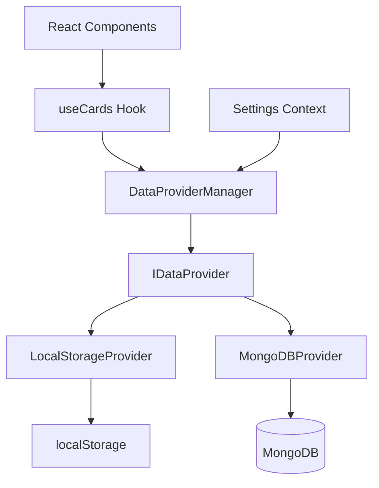

# Design Document

## Overview

This design implements a dual data provider system for the flashcard application, allowing users to seamlessly switch between localhost storage and MongoDB database storage. The solution uses a provider pattern with dependency injection to abstract data operations, ensuring consistent user experience regardless of the selected storage backend.

## Architecture

### High-Level Architecture



### Core Components

1. **DataProviderManager**: Central orchestrator that manages provider switching and routing
2. **IDataProvider Interface**: Common contract for all data providers
3. **LocalStorageProvider**: Implementation for browser localStorage
4. **MongoDBProvider**: Implementation for MongoDB operations
5. **SettingsContext**: React context for managing user preferences
6. **Settings UI**: User interface for provider selection

## Components and Interfaces

### IDataProvider Interface

```typescript
interface IDataProvider {
  // Core CRUD operations
  getCards(): Promise<Card[]>
  saveCard(card: Card): Promise<Card>
  updateCard(card: Card): Promise<Card>
  deleteCard(cardId: string): Promise<void>
  saveCards(cards: Card[]): Promise<Card[]>
  
  // Provider metadata
  getProviderName(): string
  isAvailable(): Promise<boolean>
  
  // Connection management
  connect(): Promise<void>
  disconnect(): Promise<void>
}
```

### DataProviderManager

```typescript
class DataProviderManager {
  private currentProvider: IDataProvider
  private providers: Map<string, IDataProvider>
  
  constructor(
    private settingsContext: SettingsContextType,
    private errorHandler: (error: Error) => void
  )
  
  async switchProvider(providerName: string): Promise<void>
  getCurrentProvider(): IDataProvider
  getAvailableProviders(): string[]
  private handleProviderError(error: Error, fallbackProvider?: string): void
}
```

### Settings Context

```typescript
interface SettingsContextType {
  dataProvider: 'localhost' | 'mongodb'
  setDataProvider: (provider: 'localhost' | 'mongodb') => void
  mongoConfig?: MongoDBConfig
  setMongoConfig: (config: MongoDBConfig) => void
}

interface MongoDBConfig {
  connectionString: string
  databaseName: string
  collectionName: string
}
```

## Data Models

### Enhanced Card Model
The Card interface will be extended to include example fields while maintaining backward compatibility:

```typescript
interface Card {
  id: string
  word: string
  translation: string
  isKnown: boolean
  createdAt: Date
  lastReviewed?: Date
  // New fields for enhanced context
  example?: string
  exampleTranslation?: string
}
```

### Migration Strategy
- Existing cards without example fields will continue to work
- New fields are optional to maintain backward compatibility
- Data providers must handle both old and new card formats

### Provider Configuration Model

```typescript
interface ProviderConfig {
  name: string
  displayName: string
  isDefault: boolean
  config?: Record<string, any>
}

interface AppSettings {
  selectedProvider: string
  providers: {
    localhost: ProviderConfig
    mongodb: ProviderConfig & {
      config: MongoDBConfig
    }
  }
}
```

## Error Handling

### Error Types

```typescript
enum DataProviderError {
  CONNECTION_FAILED = 'CONNECTION_FAILED',
  OPERATION_FAILED = 'OPERATION_FAILED',
  PROVIDER_UNAVAILABLE = 'PROVIDER_UNAVAILABLE',
  INVALID_CONFIGURATION = 'INVALID_CONFIGURATION'
}

class ProviderError extends Error {
  constructor(
    public type: DataProviderError,
    message: string,
    public provider: string,
    public originalError?: Error
  )
}
```

### Error Handling Strategy

1. **Graceful Degradation**: If MongoDB fails, automatically fallback to localStorage
2. **User Notification**: Display clear error messages with suggested actions
3. **Retry Logic**: Implement exponential backoff for transient failures
4. **Error Recovery**: Allow manual retry and provider switching

### Fallback Mechanism

```typescript
class FallbackHandler {
  async executeWithFallback<T>(
    primaryOperation: () => Promise<T>,
    fallbackOperation: () => Promise<T>,
    errorHandler: (error: Error) => void
  ): Promise<T>
}
```

## Testing Strategy

### Unit Tests

1. **Provider Interface Tests**
   - Test each provider implementation against the IDataProvider contract
   - Mock external dependencies (localStorage, MongoDB)
   - Test error scenarios and edge cases

2. **DataProviderManager Tests**
   - Test provider switching logic
   - Test fallback mechanisms
   - Test error handling and recovery

3. **Settings Context Tests**
   - Test configuration persistence
   - Test provider selection updates
   - Test validation of MongoDB configuration

### Integration Tests

1. **End-to-End Provider Tests**
   - Test complete CRUD operations through each provider
   - Test data consistency across provider switches
   - Test error scenarios with real dependencies

2. **UI Integration Tests**
   - Test settings menu functionality
   - Test provider switching from UI
   - Test error message display

### Component Tests

1. **Settings UI Tests**
   - Test provider selection interface
   - Test MongoDB configuration form
   - Test validation and error states

2. **Hook Integration Tests**
   - Test useCards hook with different providers
   - Test provider switching during active sessions
   - Test data persistence across provider changes

## Implementation Phases

### Phase 1: Core Infrastructure
- Create IDataProvider interface
- Implement LocalStorageProvider (refactor existing logic)
- Create DataProviderManager
- Set up SettingsContext

### Phase 2: MongoDB Integration
- Implement MongoDBProvider
- Add MongoDB configuration management
- Implement connection handling and error recovery
- Add fallback mechanisms

### Phase 3: UI Integration
- Create settings dialog/menu items
- Add provider selection interface
- Add MongoDB configuration form
- Integrate with existing settings menu

### Phase 4: Testing & Polish
- Comprehensive testing suite
- Error handling refinement
- Performance optimization
- Documentation and user guides

## Security Considerations

1. **MongoDB Connection Security**
   - Store connection strings securely (environment variables)
   - Validate connection parameters
   - Implement connection timeouts

2. **Data Validation**
   - Sanitize all user inputs
   - Validate data integrity across providers
   - Implement schema validation

3. **Error Information**
   - Avoid exposing sensitive connection details in error messages
   - Log detailed errors server-side only
   - Provide user-friendly error messages

## Performance Considerations

1. **Connection Pooling**
   - Reuse MongoDB connections
   - Implement connection lifecycle management
   - Handle connection timeouts gracefully

2. **Caching Strategy**
   - Cache frequently accessed data
   - Implement cache invalidation on data changes
   - Consider offline-first approach for localStorage

3. **Lazy Loading**
   - Load providers only when needed
   - Defer MongoDB connection until first use
   - Implement progressive data loading for large datasets